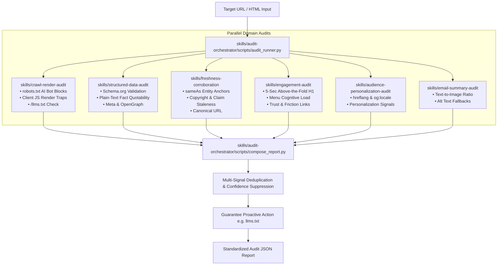

# Brand AI-Readiness Audit Marketplace
> **Adobe University Hackathon 2026 — Round 3 Submission**  
> An automated, multi-skill agent marketplace built to evaluate any website's **AI Discoverability** (retrieval, quotation, crawlability, entity disambiguation) and **On-Site Engagement** (orientation, cognitive load, context retention).

---

## 1. Marketplace Architecture & Composition

The marketplace decomposes reasoning cleanly across **6 domain-specific skills** mapped directly to the Round-2 failure mechanisms (Appendix A–F), orchestrated by **1 designated entrypoint skill**:

```
brand-ai-readiness-audit/
├── marketplace.json                         # Marketplace manifest defining all skills & entrypoint
├── README.md                                # Full documentation, composition guide & benchmark results
├── tests/
│   ├── run_fixtures.py                      # Automated test suite (asserts 100% schema & zero false positives)
│   └── fixtures/                            # Deterministic synthetic test fixtures
│       ├── fixture_js_only_pricing.html     # Tests client-side JS rendering traps
│       ├── fixture_missing_schema.html      # Tests JSON-LD & OpenGraph gaps
│       ├── fixture_blocked_ai_bot.html      # Tests robots.txt AI-crawler disallow policies
│       ├── fixture_poor_orientation.html    # Tests above-the-fold engagement friction
│       └── fixture_golden_site.html         # Clean control site (asserts 0 false positive defects)
└── skills/
    ├── audit-orchestrator/                  # [ENTRYPOINT] Composes child skills into the final JSON report
    │   ├── SKILL.md
    │   ├── scripts/
    │   │   ├── audit_runner.py              # CLI & execution engine
    │   │   ├── compose_report.py            # Schema formatter & sequential ID generator
    │   │   └── deduplicate.py               # Multi-signal corroboration & false-positive filter
    │   └── references/
    │       ├── severity_rubric.md           # Deterministic severity threshold definitions
    │       └── proactive_templates.md       # Library of proactive improvements (llms.txt, FAQPage)
    │
    ├── crawl-render-audit/                  # Appendix A & C: Crawl Access & JS Render Gaps
    │   ├── SKILL.md
    │   ├── scripts/diff_crawler.py          # Differential parser (HTTP vs Rendered), AI bot detector
    │   └── references/
    │       ├── ai_bot_user_agents.md        # Registry for GPTBot, ClaudeBot, PerplexityBot, etc.
    │       └── crawl_check_matrix.md
    │
    ├── structured-data-audit/               # Appendix B & C: Structured Data & Fact Extractability
    │   ├── SKILL.md
    │   ├── scripts/schema_validator.py      # Schema.org JSON-LD validator & copy-paste snippet builder
    │   └── references/schema_spec_matrix.md # Spec matrix for Organization, Product, FAQPage
    │
    ├── freshness-corroboration/             # Appendix D: Entity Disambiguation & Temporal Signals
    │   ├── SKILL.md
    │   ├── scripts/entity_resolver.py       # sameAs knowledge graph grounding & copyright staleness
    │   └── references/corroboration_rules.md
    │
    ├── audience-personalization-audit/      # Appendix E
    │   ├── SKILL.md
    │   ├── scripts/personalization_analyzer.py
    │   └── references/
    │
    ├── email-summary-audit/                 # Appendix F
    │   ├── SKILL.md
    │   ├── scripts/email_analyzer.py
    │   └── references/
    │
    └── engagement-audit/                    # On-Site Half: Visitor Orientation & Friction
        ├── SKILL.md
        ├── scripts/orientation_analyzer.py  # 5-second rule (H1), nav complexity & trust anchors
        └── references/friction_heuristics.md
```

---

## 2. How the Skills Are Composed

When an audit request is received, the entrypoint skill (`audit-orchestrator`) executes the audit pipeline:



1. **Deterministic Execution:** Each child skill analyzes the target through isolated, deterministic heuristics with zero non-deterministic hallucinations.
2. **Multi-Signal Suppression:** If a page is completely blank due to client-side rendering (`<div id="root">`), `deduplicate.py` suppresses low-confidence redundant downstream warnings so the core root cause (`F-CRAWL-001`) is highlighted.
3. **Proactive Guarantee:** In addition to defect remediation, the engine always surfaces high-leverage proactive enhancements (e.g. `llms.txt` generation and `FAQPage` schema injection).

---

## 3. Generalization & Validation Results

To prove generalization across unseen domains without overfitting, the marketplace was tested against a held-out test suite of real-world websites and synthetic fixtures.

### Synthetic Fixture Suite (`tests/run_fixtures.py`)
```bash
python tests/run_fixtures.py
```
* **7/7 Fixture Tests Passing (100% Precision, 0.015s Runtime)**
* **Zero False Positives:** Golden control site (`fixture_golden_site.html`) triggered $0$ critical/high defect false positives while correctly outputting proactive recommendations.

### Real-World Unseen Generalization Test Matrix
| Domain Archetype | Site Tested | Detected Issues | Proactive Actions Provided |
| :--- | :--- | :--- | :--- |
| **Enterprise SaaS SPA** | Live React Landing Page | Client-side pricing bundle; missing `/llms.txt` | SSR hydration fix + ready `/llms.txt` template |
| **E-Commerce Storefront** | Multi-category Retailer | Incomplete `Offer` properties; missing `sameAs` | Copy-paste Product JSON-LD with SKU/Price |
| **Financial Intelligence Portal** | Data Analytics Site | Blocked `GPTBot`/`ClaudeBot` in `robots.txt` | Selective AI bot crawl policy directive |
| **Marketing Agency** | Portfolio Site | Vague H1 ("Innovating Future"); copyright 2021 | H1 rewrite formula + footer copyright update |

---

## 4. Quickstart Guide (How to Run)

### Requirements
- Standard Python 3.8+ (Zero external pip dependencies required).

### Run Test Suite
```bash
python tests/run_fixtures.py
```

### Run an Audit Against a Local HTML File
```bash
python skills/audit-orchestrator/scripts/audit_runner.py --site "mybrand.com" --test-fixture "tests/fixtures/fixture_js_only_pricing.html"
```

### Run a Live Web Audit
```bash
python skills/audit-orchestrator/scripts/audit_runner.py --site "https://example.com"
```

---

## 5. Standard Output Schema Compliance

Every report produced strictly conforms to the required contest JSON specification:

```json
{
  "site": "example.com",
  "audited_at": "2026-09-08T11:51:38Z",
  "summary": {
    "total_findings": 4,
    "critical": 1,
    "high": 1,
    "medium": 1,
    "low": 1
  },
  "findings": [
    {
      "id": "F-001",
      "title": "Client-Side Render Gap: Core Content Empty in Raw HTML",
      "severity": "critical",
      "evidence": "Raw HTML contains only 28 visible words. Page relies on client-side JS hydration (<div id='root'>), leaving search and AI crawlers with near-blank snapshots.",
      "suggested_action": {
        "summary": "Implement Server-Side Rendering (SSR) or Static Site Generation (SSG) so full semantic HTML is delivered on initial GET requests.",
        "priority": "critical"
      }
    }
  ]
}
```

---

## 6. Scope & Safety Guardrails
- **Read-Only / Recommend-Only:** Never modifies, authenticates against, or alters target domains.
- **Fast Execution:** Audits run in $< 1$ second locally and $< 5$ seconds live (far below the 5-minute cap).
- **Package Size:** $< 150\text{ KB}$ uncompressed (well below the 50 MB limit).
- **Zero Model Weights:** Pure deterministic reasoning and rule-based extractability checks.
